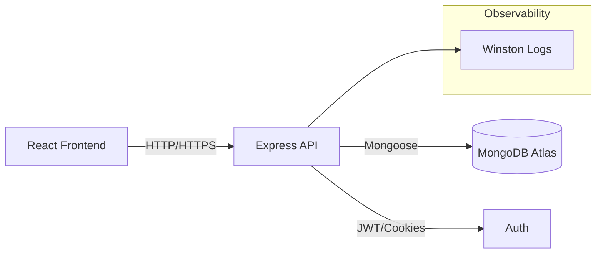

## E-Commerce Platform - Technical Architecture

### High-level Architecture (Mermaid)

### Database Schema (MongoDB)
- Users: email (unique, indexed), role, password (bcrypt), timestamps
- Products: title (text index), description (text), price (index), category (index), rating, attributes, timestamps
- Carts: user (unique), items[{ product, quantity, selectedAttributes }], timestamps
- Orders: user (index), items[{ product, title, price, quantity, selectedAttributes }], shippingAddress, paymentMethod, status (index), total, timestamps

Indexes:
- `Product`: `{ title: 'text', description: 'text' }`, `{ category: 1, price: 1, createdAt: -1 }`
- `User`: `{ email: 1 } unique`
- `Order`: `{ user: 1, createdAt: -1 }`

### API Design
- Base: `/api/v1`
- Auth: `POST /auth/register`, `POST /auth/login`, `POST /auth/logout`, `POST /auth/refresh`
- Products: `GET /products`, `GET /products/:id`
- Cart: `GET /cart`, `POST /cart/items`, `PUT /cart/items/:itemId`, `DELETE /cart/items/:itemId`
- Orders: `POST /orders`, `GET /orders`, `GET /orders/:id`

### Security
- Helmet, CORS restricted to frontend origin
- Rate limiting
- JWT access token via `Authorization: Bearer` header; refresh token via httpOnly cookie
- Input validation with Zod

### Performance
- Compression enabled
- Query indexes
- Ready for Redis caching (not wired here)

### Deployment
- Docker multi-stage for frontend and backend
- docker-compose for dev with Mongo
- Nginx serves frontend

### Monitoring
- Winston logs to console (attach to centralized logging in prod)

